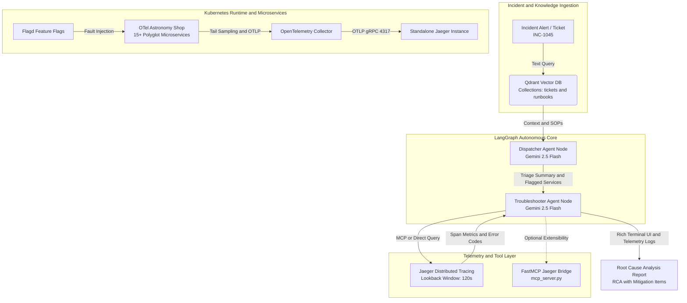

# Autonomous SRE Incident Triage Agent: Graph-Orchestrated Telemetry Reasoning & Vector Runbook Verification

An enterprise-grade autonomous Site Reliability Engineering (SRE) incident response system built with **LangGraph**, **Google Gemini**, **OpenTelemetry**, **Jaeger**, **Qdrant**, and the **Model Context Protocol (MCP)**.

This project demonstrates how autonomous agents can ingest telemetry from microservice architectures, prune diagnostic paths using deterministic vector runbooks, correlate distributed traces across cascading boundaries, and isolate root causes to dramatically reduce **Mean Time to Resolution (MTTR)**.

---

## Executive Summary & Value Proposition

Modern distributed microservice architectures produce millions of spans per second, overwhelming on-call engineers with alert storms, opaque service dependencies, and uncoordinated dashboards.

Traditional troubleshooting relies on tribal knowledge, static playbooks, and manual trace inspection. Autonomous triage agents solve this by pairing **probabilistic large language models (LLMs)** with **deterministic operational constraints (RAG & Observability Pipelines)**:

* **Vendor-Neutral OpenTelemetry Core:** Telemetry collection is standardized on pure OpenTelemetry semantic conventions and OTLP export pipelines rather than proprietary vendor SDKs.
* **Deterministic Guardrails Over Hallucination:** Instead of allowing unconstrained LLM queries, the agent queries domain-specific Standard Operating Procedures (SOPs) stored in a Qdrant vector database (`RB-001` through `RB-004`), ensuring investigations follow enterprise-approved diagnostic sequences.
* **Causal Graph Correlation:** The agent identifies cascading failure states—such as an upstream Envoy proxy socket reset (`response_flags: DC`, `http.status_code: 0`) triggered by a downstream gRPC timeout (`status_code: 13` or `DEADLINE_EXCEEDED`).
* **Agent Observability Built-In:** The triage workflow is self-instrumented via Traceloop and OpenLLMetry, exporting LLM tokens, step durations, and tool calls as standard OTel traces for auditability and compliance.

---

## Architecture & Workflow

The architecture decouples operational knowledge (vector database), service telemetry (distributed tracing), and agent orchestration (directed state graph):



---

## Technical Stack

* **Agent Orchestration:** [LangGraph](https://github.com/langchain-ai/langgraph) (StateGraph compiling state transitions between Dispatcher and Troubleshooter nodes).
* **Reasoning Engine:** [Google Gemini 2.5 Flash](https://ai.google.dev/) via `langchain-google-genai`.
* **Vector Memory & Runbook RAG:** [Qdrant](https://qdrant.tech/) with in-process vectorization using [FastEmbed](https://github.com/qdrant/fastembed) (`BAAI/bge-small-en-v1.5`, 384 dimensions).
* **Distributed Tracing:** [Jaeger Standalone](https://www.jaegertracing.io/) running alongside OpenTelemetry Collector with Tail-based sampling processors.
* **Target Workload:** [OpenTelemetry Astronomy Shop](https://github.com/open-telemetry/opentelemetry-demo) (15+ microservices deployed via Helm in a `kind` cluster).
* **Chaos & Control Plane:** [OpenFeature / Flagd](https://flagd.dev/) for dynamic runtime fault injection.
* **Extensible Protocol Integration:** [FastMCP](https://github.com/jlowin/fastmcp) server bridge exposing Jaeger trace analytics over JSON-RPC.
* **Agent Telemetry:** [Traceloop SDK](https://www.traceloop.com/) for OpenLLMetry span generation.

---

## Repository Structure

```text
.
├── bootstrap.sh            # Automated local cluster and demo deployment script
├── cleanup.sh              # Teardown script for cluster and port-forwards
├── jaeger-deploy.yaml      # Standalone Jaeger All-In-One manifest (UI: 16686, OTLP: 4317)
├── mcp_server.py           # FastMCP server exposing Jaeger trace analysis to AI agents
├── otel-values.yaml        # Helm values for OTel Demo, Tail Sampling, and Flagd toggles
├── requirements.txt        # Python dependencies for the agent framework
├── seed_qdrant.py          # Vector DB bootstrap: baseline tickets (INC-1042..1044) & runbooks
├── seed_incident_1045.py   # Ingestion script for INC-1045 and Product Catalog runbook RB-004
└── sre_agents.py           # LangGraph state machine, agent nodes, and Rich terminal UI
```

---

## Prerequisites & Local Setup

### 1. Environment Requirements

* macOS or Linux with **Docker** or **OrbStack**
* `kind` (Kubernetes in Docker), `kubectl`, and `helm` installed
* Python 3.10+
* Google Gemini API Key

### 2. Infrastructure Bootstrap

Clone the repository and run the automated bootstrap script to spin up the `sre-demo` cluster, deploy Qdrant, standalone Jaeger, and the OTel Astronomy Shop:

```bash
git clone [https://github.com/](https://github.com/)hbill75/autonomous-sre-agent.git
cd autonomous-sre-agent

chmod +x bootstrap.sh cleanup.sh
./bootstrap.sh
```

### 3. Establish Port Forwards

Run these port-forwarding commands in separate terminal sessions:

```bash
# Terminal 1: Astronomy Shop Storefront & Feature Flag UI (Port 8080)
kubectl port-forward svc/otel-demo-frontendproxy 8080:8080 -n observability

# Terminal 2: Jaeger Tracing Query UI & API (Port 16686)
kubectl port-forward svc/jaeger-standalone 16686:16686 -n default

# Terminal 3: Qdrant Vector Search Engine (Port 6333)
kubectl port-forward svc/qdrant 6333:6333 -n observability
```

### 4. Python Environment & Dependency Installation

Create a dedicated virtual environment and install the required packages:

```bash
python3 -m venv .venv
source .venv/bin/activate
pip install -r requirements.txt
```

Create a `.env` file in the project root:

```bash
echo "GEMINI_API_KEY=AIzaSyYourActualKeyHere" > .env
```

### 5. Initialize the Vector Memory

Seed historical tickets and standard operating runbooks into Qdrant:

```bash
# Seed initial knowledgebase (Tickets INC-1042..1044, Runbooks RB-001..003)
python3 seed_qdrant.py

# Seed active incident target INC-1045 and Product Catalog Runbook RB-004
python3 seed_incident_1045.py
```

---

## Interactive Customer Demonstration Script

Follow this step-by-step walkthrough to present the agent's incident lifecycle live to customers, hiring managers, or architecture evaluation panels.

### Step 1: Establish the Healthy Baseline

1. Open the storefront at `http://localhost:8080` and click through 2–3 items.
2. Open Jaeger at `http://localhost:16686`. Search for `service: frontend` to confirm requests complete with `http.status_code: 200` and sub-100ms durations.

### Step 2: Inject Chaos via Feature Flags

Simulate a severe backend outage in the Astronomy Shop:

1. Open the Flagd configuration UI at `http://localhost:8080/feature`.
2. Locate the flag **`productCatalogFailure`** and toggle it to **`on`**.
3. Return to `http://localhost:8080` and click on any product (or attempt to browse catalog items). The UI will stall, spin, and throw HTTP 500 error banners.

### Step 3: Execute the Autonomous Triage Agent

Trigger the agent to investigate `INC-1045`:

```bash
python3 sre_agents.py
```

### Step 4: Explain the Agent's Diagnostic Reasoning

Walk the audience through the generated terminal output:

1. **Dispatcher Phase (Qdrant RAG):** Point out how the Dispatcher query pulled `RB-004` ("Troubleshooting Product Catalog Service Failures") rather than guessing. The agent automatically flagged `frontend`, `productcatalogservice`, and `checkoutservice` as the investigation scope.
2. **Telemetry Correlation (Jaeger Ingestion):** Explain that the Troubleshooter queried Jaeger specifically within a 120-second window to prevent stale data contamination.
3. **Causal Failure Diagnosis:** Show the audience how the agent extracted the root failure:
   * Pinpointed that `ProductCatalogService.GetProduct` threw an explicit `rpc.grpc.status_code = 13 (INTERNAL)`.
   * Identified that the upstream Next.js `/api/recommendations` route failed to handle the exception, bubbling up to Envoy as a client socket cancellation (`canceled: true`, `response_flags: DC`).
   * Matched the failure mode to the active chaos flag and prioritized disabling it in the Immediate Action Items.

### Step 5: Verify Mitigation

1. In `http://localhost:8080/feature`, toggle **`productCatalogFailure`** back to **`off`**.
2. Refresh the storefront at `http://localhost:8080` to verify clean 200 OK responses.
3. Re-run `python3 sre_agents.py` to demonstrate that the agent verifies the resolution and reports telemetry returning to healthy baseline thresholds.

---

## Key Observability Patterns Demonstrated

### 1. Tail-Based Sampling Configuration

To prevent telemetry flooding while guaranteeing 100% capture of critical incidents, the OpenTelemetry Collector uses tail-based sampling defined in `otel-values.yaml`:

* **Error Policy:** Captures all traces where `status_code: ERROR`.
* **Latency Policy:** Captures any transaction exceeding 1,500ms (`threshold_ms: 1500`).
* **Probabilistic Policy:** Retains 5% of healthy baseline traces for historical comparison.

### 2. Decoupled Tool Execution via FastMCP

The repository includes `mcp_server.py`, demonstrating how to decouple distributed tracing queries from the agent runtime using the **Model Context Protocol (MCP)**:

* Run the standalone FastMCP server:
  ```bash
  python3 mcp_server.py
  ```
* Any MCP-compliant client can discover `analyze_service_traces` dynamically over JSON-RPC, isolating the agent process from direct API SDK dependencies and credentials.

---

## Teardown

To cleanly tear down all port-forwards, delete the `sre-demo` Kind cluster, and purge local container resources, execute:

```bash
./cleanup.sh
```