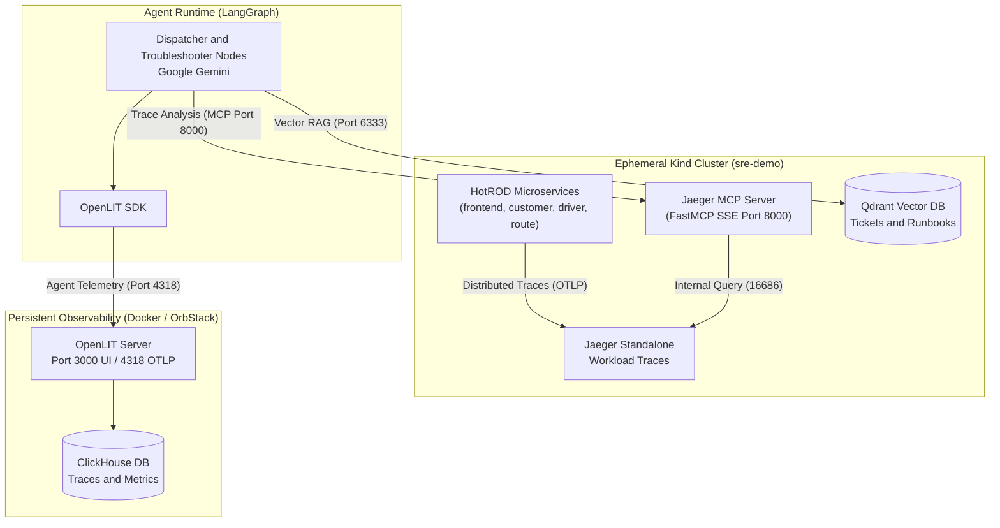

# Autonomous SRE Incident Triage Agent (MCP & OpenTelemetry)

An autonomous Site Reliability Engineering (SRE) incident response testbed combining **LangGraph**, **Google Gemini**, **OpenTelemetry**, **Jaeger**, **Qdrant**, and the **Model Context Protocol (MCP)**.

The agent investigates microservice outages in Jaeger HotROD by retrieving approved operating runbooks from Qdrant vector memory, querying distributed trace telemetry via an in-cluster FastMCP server over Server-Sent Events (SSE), synthesizing root cause analysis (RCA) reports, and exporting full agent execution metrics to OpenLIT and ClickHouse.

---

## Architecture Overview


```mermaid
flowchart TD
    subgraph Ephemeral_Kind ["Ephemeral Kind Cluster (sre-demo)"]
        direction TB
        HR["HotROD Microservices<br>(frontend, customer, driver, route)"]
        JG["Jaeger Standalone<br>Workload Traces"]
        MCP["Jaeger MCP Server<br>(FastMCP SSE Port 8000)"]
        QD[("Qdrant Vector DB<br>Tickets and Runbooks")]

        HR -->|"Distributed Traces (OTLP)"| JG
        MCP -->|"Internal Query (16686)"| JG
    end

    subgraph Agent_Runtime ["Agent Runtime (LangGraph)"]
        direction TB
        AG["Dispatcher and Troubleshooter Nodes<br>Google Gemini"]
        SDK["OpenLIT SDK"]

        AG --> SDK
    end

    subgraph Persistent_Obs ["Persistent Observability (Docker / OrbStack)"]
        direction TB
        OL["OpenLIT Server<br>Port 3000 UI / 4318 OTLP"]
        CH[("ClickHouse DB<br>Traces and Metrics")]

        OL --> CH
    end

    AG -->|"Vector RAG (Port 6333)"| QD
    AG -->|"Trace Analysis (MCP Port 8000)"| MCP
    SDK -->|"Agent Telemetry (Port 4318)"| OL

```

---

## Repository Structure

```text
.
├── openlit-bootstrap.sh         # Boots persistent OpenLIT & ClickHouse in Docker/OrbStack
├── docker-compose.openlit.yaml  # Multi-container Compose manifest for OpenLIT & ClickHouse
├── openlit-config/              # OpenLIT & ClickHouse configuration assets
│   ├── clickhouse-config.xml
│   ├── clickhouse-init.sh
│   └── otel-collector-config.yaml
├── bootstrap.sh                 # Builds Kind cluster, deploys HotROD, Jaeger, Qdrant, & Jaeger MCP
├── cleanup.sh                   # Destroys Kind cluster and terminates background tunnels
├── demo_setup.sh                # Automates iTerm windows, .venv, .env, vector seeding, & failure traffic
├── port_forwards.sh             # Exposes in-cluster services (HotROD, Jaeger, Qdrant, MCP SSE)
├── simulate_errors.sh           # Generates HotROD error traffic (Customer ID 99999)
├── Dockerfile.mcp               # Container build file for the in-cluster FastMCP server
├── mcp_server.py                # FastMCP server exposing Jaeger trace query tools over SSE
├── mcp-server-deploy.yaml       # Kubernetes Deployment and Service for the Jaeger MCP server
├── jaeger-deploy.yaml           # Standalone Jaeger All-in-One deployment manifest
├── hotrod-deploy.yaml           # Jaeger HotROD microservices deployment manifest
├── seed_qdrant.py               # Vector DB ingestion: indexes INC-2001 and RB-010 via FastEmbed
├── sre_agents.py                # LangGraph state machine, agent nodes, and MCP client
└── requirements.txt             # Python dependencies for agent runtime

```

---

## Prerequisites

* **Container Runtime:** Docker Desktop, Docker Engine, or OrbStack (with Docker Compose v2)


* **CLI Tools:** `kind`, `kubectl`, `helm`

* **Terminal:** macOS [iTerm2](https://iterm2.com/) (required by `demo_setup.sh` automation)
* **Python:** 3.11+


* **API Key:** Google Gemini API Key from [Google AI Studio](https://aistudio.google.com/)


---

## Quickstart Setup

### 1. Clone the Repository

Clone the repository and enter the directory:

```bash
git clone https://github.com/hbill75/observe-sre-triage-agent.git
cd observe-sre-triage-agent

```

Make all shell scripts executable:

```bash
chmod +x openlit-bootstrap.sh bootstrap.sh demo_setup.sh cleanup.sh port_forwards.sh simulate_errors.sh

```

### 2. Start Persistent AI Observability (OpenLIT)

Start the ClickHouse and OpenLIT containers in Docker/OrbStack so telemetry persists across Kubernetes cluster restarts:

```bash
./openlit-bootstrap.sh

```

Verify the OpenLIT web dashboard is accessible at `http://localhost:3000` before proceeding.

### 3. Bootstrap the Kubernetes Cluster

Spin up the Kind cluster, bridge OpenLIT networking, deploy Qdrant and standalone Jaeger, build the FastMCP server container image, and deploy HotROD:

```bash
./bootstrap.sh

```

### 4. Run Automated Demo Setup

Run the demo setup script to automate background tunnels and prepare the agent environment:

```bash
./demo_setup.sh

```

This script automatically:

1. Spawns an iTerm window to run `./port_forwards.sh`.


2. Configures the `.venv` Python virtual environment and installs all dependencies.


3. Configures `.env` and securely prompts for your Google Gemini API key.


4. Polls the Qdrant port-forward until reachable and executes `seed_qdrant.py` (indexing ticket INC-2001 and runbook RB-010).


5. Spawns a second iTerm window running `./simulate_errors.sh` to generate live HotROD error spans.


6. Displays the dashboard access links in the terminal.


---

## Running the SRE Agent

Because `./demo_setup.sh` manages its setup within a child subshell, explicitly activate the virtual environment in your current terminal session, then trigger the agent workflow:

```bash
source .venv/bin/activate
python3 sre_agents.py

```

### What Happens During Execution

1. **Dispatcher Agent:** Queries Qdrant for incident `INC-2001` and runbook `RB-010` to triage symptoms and identify impacted microservices (`frontend`, `customer`).


2. **Troubleshooter Agent:** Connects over SSE to the in-cluster MCP server (`http://localhost:8000/sse`) and invokes `query_service_traces`.
3. **In-Cluster FastMCP Server:** Queries Jaeger via internal Kubernetes DNS (`jaeger-standalone.default.svc.cluster.local:16686`), filters out healthy spans, sanitizes demo tags, and returns failing trace spans.
4. **Root Cause Analysis (RCA):** Gemini analyzes the live spans and runbook guidelines to print a structured RCA report containing duration metrics, error tags, and direct Jaeger trace URLs.
5. **Observability Capture:** OpenLIT records the multi-agent graph execution, LLM token metrics, latency, and MCP tool invocations to ClickHouse.


---

## Interactive Access Points

| Service | Endpoint | Description |
| --- | --- | --- |
| **HotROD UI** | [http://localhost:8080](http://localhost:8080) | Microservices rides storefront (generate manual ride traffic)

 |
| **Jaeger Web UI** | [http://localhost:16686](http://localhost:16686) | Distributed trace waterfalls and span error inspector

 |
| **Jaeger MCP Server** | [http://localhost:8000/sse](http://localhost:8000/sse) | FastMCP Server-Sent Events endpoint for agent tool calls |
| **Qdrant Vector DB** | [http://localhost:6333/dashboard](http://localhost:6333/dashboard) | Vector database dashboard for indexed tickets and runbooks

 |
| **OpenLIT Dashboard** | [http://localhost:3000](http://localhost:3000) | GenAI telemetry, agent graphs, token spend, and trace costs

 |

---

## Teardown

To delete the Kind cluster and terminate all background port-forward tunnels while preserving OpenLIT trace history:

```bash
./cleanup.sh

```

To shut down OpenLIT and delete ClickHouse database storage volumes:

```bash
docker compose -f docker-compose.openlit.yaml down -v

```