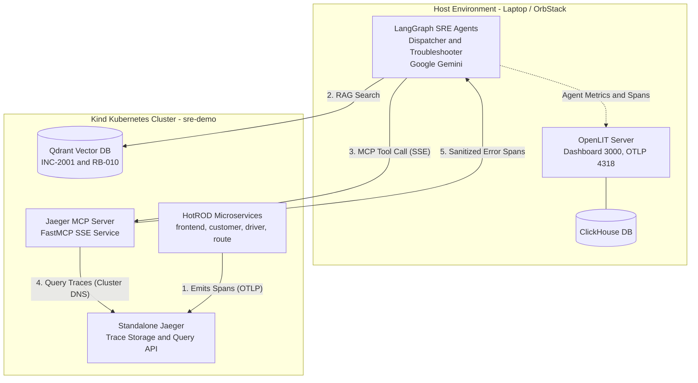

# Autonomous SRE Incident Triage Agent (MCP & OpenTelemetry)

A local reference implementation demonstrating autonomous Site Reliability Engineering (SRE) incident triage. The system investigates microservice failures in Jaeger HotROD using a LangGraph multi-agent workflow powered by Google Gemini. The agent retrieves approved runbooks from Qdrant vector memory, queries distributed traces via an in-cluster Model Context Protocol (MCP) server over Server-Sent Events (SSE), and records full agent reasoning and token metrics into OpenLIT.

---

## Architecture Overview


```mermaid
flowchart TD
    subgraph Host_Environment [Host Environment - Laptop / OrbStack]
        direction TB
        AG["LangGraph SRE Agents<br>Dispatcher and Troubleshooter<br>Google Gemini"]
        OL["OpenLIT Server<br>Dashboard 3000, OTLP 4318"]
        CH[("ClickHouse DB")]

        AG -. "Agent Metrics and Spans" .-> OL
        OL --- CH
    end

    subgraph K8s_Cluster [Kind Kubernetes Cluster - sre-demo]
        direction TB
        QD[("Qdrant Vector DB<br>INC-2001 and RB-010")]
        MCP["Jaeger MCP Server<br>FastMCP SSE Service"]
        JG["Standalone Jaeger<br>Trace Storage and Query API"]
        HR["HotROD Microservices<br>frontend, customer, driver, route"]

        QD ~~~ MCP
        MCP -->|"4. Query Traces (Cluster DNS)"| JG
        HR -->|"1. Emits Spans (OTLP)"| JG
    end

    AG -->|"2. RAG Search"| QD
    AG -->|"3. MCP Tool Call (SSE)"| MCP
    MCP -->|"5. Sanitized Error Spans"| AG
```

---

## Repository Structure

```text
.
├── openlit-bootstrap.sh         # Starts persistent OpenLIT & ClickHouse in Docker/OrbStack
├── docker-compose.openlit.yaml  # OpenLIT & ClickHouse multi-container configuration
├── openlit-config/              # OpenLIT & ClickHouse initialization assets
│   ├── clickhouse-config.xml
│   ├── clickhouse-init.sh
│   └── otel-collector-config.yaml
├── bootstrap.sh                 # Provisions Kind cluster, builds Jaeger MCP image, deploys HotROD & Qdrant
├── cleanup.sh                   # Tears down Kind cluster and background port-forwards
├── port_forwards.sh             # Establishes background tunnels (HotROD, Jaeger UI, Qdrant, MCP SSE)
├── simulate_errors.sh           # Generates HotROD failure traffic (customer ID 99999)
├── Dockerfile.mcp               # Container build file for the in-cluster FastMCP server
├── mcp_server.py                # In-cluster FastMCP server exposing Jaeger trace tools
├── mcp-server-deploy.yaml       # Kubernetes Deployment and Service for the Jaeger MCP server
├── jaeger-deploy.yaml           # Standalone Jaeger All-in-One deployment manifest
├── hotrod-deploy.yaml           # HotROD microservices deployment manifest
├── seed_qdrant.py               # Vector DB initialization: seeds ticket INC-2001 & runbook RB-010
├── sre_agents.py                # LangGraph state machine with MCP client integration
├── requirements.txt             # Python dependencies
└── .env                         # API keys and local endpoint configurations

```

---

## Prerequisites

* **Container Runtime:** Docker Desktop, Docker Engine, or OrbStack (with Docker Compose v2)


* **CLI Tools:** `kind`, `kubectl`, `helm`

* **Python:** 3.11+


* **API Key:** Google Gemini API Key from [Google AI Studio](https://aistudio.google.com/)


---

## Quickstart Execution Sequence

### 1. Launch Persistent AI Observability (OpenLIT)

Start ClickHouse and OpenLIT in Docker/OrbStack so telemetry persists across Kubernetes rebuilds:

```bash
chmod +x openlit-bootstrap.sh bootstrap.sh port_forwards.sh cleanup.sh simulate_errors.sh
./openlit-bootstrap.sh

```

Verify the web dashboard is accessible at `http://localhost:3000`.

### 2. Bootstrap the Kubernetes Cluster & Workloads

Spin up the Kind cluster, bridge OpenLIT DNS, install Qdrant and Jaeger, build the in-cluster MCP server image, and deploy HotROD:

```bash
./bootstrap.sh

```

### 3. Establish Port-Forwards

Start background tunnels to expose in-cluster services to localhost:

```bash
./port_forwards.sh

```

* HotROD UI: `http://localhost:8080`

* Jaeger Web UI: `http://localhost:16686`

* Jaeger MCP Server: `http://localhost:8000/sse`
* Qdrant Vector DB: `http://localhost:6333`


### 4. Setup Python Environment & Secrets

Create a virtual environment and install project dependencies:

```bash
python3 -m venv .venv
source .venv/bin/activate
pip install -r requirements.txt

```

Create a `.env` file in the project root:

```bash
cat << 'EOF' > .env
GEMINI_API_KEY="your_gemini_api_key_here"
OTEL_EXPORTER_OTLP_ENDPOINT="http://localhost:4318"
OPENLIT_ENVIRONMENT="development"
MCP_SERVER_URL="http://localhost:8000/sse"
QDRANT_URL="http://localhost:6333"
EOF

```

### 5. Seed Vector Knowledge Base

Index historical incident INC-2001 and standard operating runbook RB-010 into Qdrant:

```bash
python3 seed_qdrant.py

```

### 6. Generate Failure Traffic in HotROD

Inject failing ride requests to emit HTTP 404/500 error spans to Jaeger:

```bash
./simulate_errors.sh

```

*(Alternatively, execute a single failure: `curl -s "http://localhost:8080/dispatch?customer=99999"`)*

### 7. Run the Autonomous SRE Agent

Trigger the LangGraph triage workflow:

```bash
python3 sre_agents.py

```

The agent will:

1. Query Qdrant for incident INC-2001 and runbook RB-010 to determine impacted services (`frontend`, `customer`).


2. Connect to the in-cluster MCP server over SSE (`http://localhost:8000/sse`) and invoke `query_service_traces`.
3. Filter out healthy spans and parse failing trace IDs and error tags.
4. Output a formatted Root Cause Analysis (RCA) report in your terminal with direct Jaeger trace URLs.


5. Stream agent token metrics and execution graphs to OpenLIT at `http://localhost:3000`.


---

## Teardown

To delete the Kind cluster and terminate all background port-forward tunnels while preserving OpenLIT trace history:

```bash
./cleanup.sh

```

To permanently stop OpenLIT and delete persistent ClickHouse volumes:

```bash
docker compose -f docker-compose.openlit.yaml down -v

```