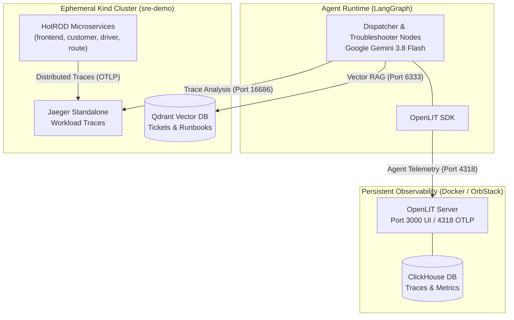

# Autonomous SRE Incident Triage Agent: Graph-Orchestrated Telemetry Reasoning & Vector Runbook Verification

A containerized reference implementation and hands-on laboratory demonstrating autonomous Site Reliability Engineering (SRE) incident triage built with **LangGraph**, **Google Gemini**, **OpenTelemetry**, **Jaeger**, **Qdrant**, and **OpenLIT**.

This project demonstrates how autonomous agents can ingest telemetry from microservice architectures, prune diagnostic paths using deterministic vector runbooks, correlate distributed traces across cascading boundaries, and isolate root causes to dramatically reduce **Mean Time to Resolution (MTTR)**.

---

## Why Build This Lab?

We have all stared down alert storms during an outage—tracing cascading errors across microservices while jumping between dashboards, logs, and stale wiki pages.

This repository is a self-contained, hands-on testbed designed to experiment with a better workflow: **What happens when you give an agentic AI direct access to OpenTelemetry distributed traces and deterministic operational runbooks?**

Feel free to spin this up locally, generate real microservice failure streams, and inspect the implementation:

* **Real Distributed Architecture:** Runs Jaeger's canonical **HotROD** ride-sharing application (`frontend`, `customer`, `driver`, `route`) inside a lightweight local Kind cluster.


* **No Hallucinated SOPs:** Rather than letting an LLM guess remediation steps, the agent retrieves real Markdown runbooks from a local Qdrant vector database to guide its troubleshooting path.


* **Real Trace Telemetry:** Queries local Jaeger instances using OpenTelemetry semantic conventions to catch cascading HTTP 404s, unhandled 500s, and Redis storage contention.


* **Observing the Observer:** Instruments the triage agent itself using OpenLIT, capturing LLM token costs, step durations, and reasoning traces into ClickHouse.


* **Zero Cloud Lock-in:** Built entirely on open-source standards (OTel, OTLP, Jaeger, Qdrant, ClickHouse, Kind) so you can run, break, and inspect everything locally.


---

## Executive Summary & Value Proposition

Modern distributed microservice architectures produce millions of spans per second, overwhelming on-call engineers with alert storms, opaque service dependencies, and uncoordinated dashboards.

Traditional troubleshooting relies on tribal knowledge, static playbooks, and manual trace inspection. Autonomous triage agents solve this by pairing **probabilistic large language models (LLMs)** with **deterministic operational constraints (RAG & Observability Pipelines)**:

* **Vendor-Neutral OpenTelemetry Core:** Telemetry collection is standardized on pure OpenTelemetry semantic conventions and OTLP export pipelines rather than proprietary vendor SDKs.


* **Deterministic Guardrails Over Hallucination:** Instead of allowing unconstrained LLM queries, the Dispatcher agent queries domain-specific Standard Operating Procedures (SOPs) stored in a Qdrant vector database (`RB-010`), ensuring investigations follow enterprise-approved diagnostic sequences.


* **Causal Graph Correlation:** The agent identifies cascading failure states—such as an upstream HTTP 500 error at the `frontend` dispatch boundary triggered by an unhandled downstream 404 from the `customer` service and concurrent Redis mutex contention in `driver`.


* **Autonomous Hypothesis Correction:** When initial ticket context misidentifies affected services, the Troubleshooter agent cross-references live Jaeger traces to self-correct the investigation scope.
* **Agent Observability Built-In:** The agent runtime is self-instrumented via OpenLIT, exporting LLM tokens, step durations, and tool calls as standard OTel traces for governance, auditability, and cost accounting.


---

## Architecture & Workflow

The architecture decouples operational knowledge (vector database), service telemetry (distributed tracing), and persistent agent governance (AI observability):


```mermaid
flowchart TD
    subgraph Persistent_Observability ["Persistent Observability (Docker / OrbStack)"]
        OL["OpenLIT Server<br>Port 3000 UI / 4318 OTLP"]
        CH[("ClickHouse DB<br>Traces & Metrics")]
        OL --- CH
    end

    subgraph Agent_Runtime ["Agent Runtime (LangGraph)"]
        AG["Dispatcher & Troubleshooter Nodes<br>Google Gemini 3.8 Flash"]
        OL_SDK["OpenLIT SDK"]
        AG --- OL_SDK
        OL_SDK -->|"Agent Telemetry (Port 4318)"| OL
    end

    subgraph Ephemeral_Cluster ["Ephemeral Kind Cluster (sre-demo)"]
        QD[("Qdrant Vector DB<br>Tickets & Runbooks")]
        HR["HotROD Microservices<br>(frontend, customer, driver, route)"]
        JG["Jaeger Standalone<br>Workload Traces"]
        HR -->|"Distributed Traces (OTLP)"| JG
    end

    AG -->|"Vector RAG (Port 6333)"| QD
    AG -->|"Trace Analysis (Port 16686)"| JG

```

---

## Technical Stack

* **Agent Orchestration:** [LangGraph](https://github.com/langchain-ai/langgraph) (StateGraph managing state transitions between Dispatcher and Troubleshooter nodes).


* **Reasoning Engine:** [Google Gemini](https://ai.google.dev/) (`gemini-3.8-flash`) via `langchain-google-genai`.


* **Vector Memory & Runbook RAG:** [Qdrant](https://qdrant.tech/) with in-process vectorization using [FastEmbed](https://github.com/qdrant/fastembed) (`BAAI/bge-small-en-v1.5`, 384 dimensions).


* **Distributed Tracing:** [Jaeger Standalone](https://www.jaegertracing.io/) running All-In-One with an OTLP ingestion pipeline.


* **Target Workload:** [Jaeger HotROD](https://github.com/jaegertracing/jaeger/tree/main/examples/hotrod) (Ride-on-Demand microservice application simulating distributed transactions, lock contention, and DB lookups).


* **AI Observability & Cost Tracking:** [OpenLIT](https://openlit.io/) backed by [ClickHouse](https://clickhouse.com/) for monitoring agent latency, LLM tokens, and execution graphs.


---

## Repository Structure

```text
.
├── bootstrap.sh                 # Cluster bootstrap: Kind, HotROD, Jaeger, and Qdrant
├── cleanup.sh                   # Teardown script for cluster, port-forwards, and resources
├── docker-compose.openlit.yaml  # Persistent ClickHouse & OpenLIT stack
├── openlit-config/              # Vendored OpenLIT & ClickHouse initialization assets
│   ├── clickhouse-config.xml
│   ├── clickhouse-init.sh
│   └── otel-collector-config.yaml
├── jaeger-deploy.yaml           # Standalone Jaeger All-In-One manifest (UI: 16686, OTLP: 4317/4318)
├── hotrod-deploy.yaml           # HotROD microservices deployment manifest (Port 8080)
├── requirements.txt             # Python dependencies for the agent framework
├── seed_qdrant.py               # Vector DB bootstrap: baseline tickets (INC-2001) & runbook (RB-010)
├── simulate_errors.sh           # Traffic and failure injector (generates live HotROD error traces)
└── sre_agents.py                # LangGraph state machine, agent nodes, and Rich terminal UI

```

---

## Prerequisites & Tooling Installation

Ensure you have the required container engine, Kubernetes CLI utilities, and Python runtime installed on your machine.

### macOS (via Homebrew)

```bash
# 1. Install container runtime (OrbStack recommended for Apple Silicon, or Docker Desktop)
brew install --cask orbstack

# 2. Install Kubernetes, Cluster, and Helm CLIs
brew install kind kubectl helm

# 3. Install Python 3.11
brew install python@3.11

```

### Linux (Ubuntu / Debian)

```bash
# 1. Install Docker Engine and Compose plugin
sudo apt-get update && sudo apt-get install -y docker.io docker-compose-v2

# 2. Install kubectl
curl -LO "https://dl.k8s.io/release/$(curl -L -s https://dl.k8s.io/release/stable.txt)/bin/linux/amd64/kubectl"
sudo install -o root -g root -m 0755 kubectl /usr/local/bin/kubectl && rm kubectl

# 3. Install kind
curl -Lo ./kind https://kind.sigs.k8s.io/dl/v0.24.0/kind-linux-amd64
chmod +x ./kind && sudo mv ./kind /usr/local/bin/kind

# 4. Install Helm
curl https://raw.githubusercontent.com/helm/helm/main/scripts/get-helm-3 | bash

# 5. Install Python 3.11 and venv
sudo apt-get install -y python3.11 python3.11-venv

```

### API Keys

* **Google Gemini API Key:** Obtain an API key from [Google AI Studio](https://aistudio.google.com/).


---

## Step-by-Step Setup

### 1. Clone the Repository

```bash
git clone https://github.com/hbill75/observe-sre-triage-agent.git
cd observe-sre-triage-agent

```

### 2. Start Persistent AI Observability (OpenLIT + ClickHouse)

To ensure your agent's LLM metrics, prompt histories, and token analytics survive Kind cluster restarts, start OpenLIT out-of-band:

```bash
docker compose -f docker-compose.openlit.yaml up -d

```

Verify the OTLP trace ingestion endpoint is healthy:

```bash
curl -i -X POST http://localhost:4318/v1/traces \
  -H "Content-Type: application/json" \
  -d '{"resourceSpans":[]}'

```

(Expect `HTTP/1.1 200 OK` with `{"partialSuccess":{}}`).

### 3. Bootstrap the Kind Cluster with HotROD & Jaeger

Run the automated bootstrap script to spin up the `sre-demo` cluster, deploy Qdrant, Jaeger, and HotROD, and validate cross-service connectivity:

```bash
chmod +x bootstrap.sh cleanup.sh simulate_errors.sh port_forwards.sh
./bootstrap.sh

```

### 4. Establish Background Port-Forwards

Open one new terminal tab to expose the cluster services:

```bash
./port_forwards.sh

```

### 5. Configure Python Virtual Environment & Dependencies

In your main terminal, create a virtual environment using Python 3.11 and install the required packages:

```bash
python3.11 -m venv .venv
source .venv/bin/activate
pip install --upgrade pip
pip install -r requirements.txt

```

Create a `.env` file containing your Gemini API key and telemetry configuration:

```bash
cat << 'EOF' > .env
GEMINI_API_KEY=your_actual_gemini_api_key_here
OTEL_EXPORTER_OTLP_ENDPOINT=http://localhost:4318
OPENLIT_ENVIRONMENT=development
EOF

```

### 6. Seed the Vector Database with Runbooks

Initialize Qdrant collections and upsert incident `INC-2001` alongside runbook `RB-010`:

```bash
python3 seed_qdrant.py

```

### 7. Run the Error Generation Script

In a spare terminal tab, start the continuous traffic generator:

```bash
./simulate_errors.sh

```

This script sends a continuous stream of valid ride dispatches alongside invalid customer requests (`customer=99999`), generating live error spans and database mutex events in Jaeger.

### 8. Execute the Autonomous SRE Triage Agent

Trigger the agent to investigate the active incident:

```bash
python3 sre_agents.py

```

---

## Interactive Customer Demonstration Script

Follow this step-by-step walkthrough to present the agent's incident lifecycle live to customers, team members, or architectural evaluation panels.

### Step 1: Establish the Healthy Baseline

1. Open HotROD at `http://localhost:8080` and click on any customer button (e.g., **Rachel's Floral Designs**).
2. Open Jaeger at `http://localhost:16686`. Search for `service: frontend` to confirm requests complete with `http.status_code: 200` and normal duration spans.


### Step 2: Inject Live Errors

Start the background traffic generator:

```bash
./simulate_errors.sh

```

The script emits two types of telemetry simultaneously:

* **Invalid Customer Dispatches:** Sends `GET /dispatch?customer=99999`, triggering HTTP 404s inside the `customer` service that bubble up as unhandled HTTP 500 errors to the `frontend`.
* **Redis Lock Contention:** Concurrently dispatches valid rides, triggering HotROD's built-in `GetDriver` mutex delays in Redis.

### Step 3: Run Autonomous Triage

Execute the agent:

```bash
python3 sre_agents.py

```

### Step 4: Explain the Agent's Diagnostic Reasoning

Walk the audience through the generated terminal output:

1. **Dispatcher Phase (Qdrant RAG):**
Highlight that the Dispatcher retrieves runbook `RB-010` (*"Troubleshooting Ride Dispatch Failures"*) directly from Qdrant rather than guessing troubleshooting steps.
2. **Autonomous Hypothesis Correction:**
Show how the Dispatcher initially flagged only `frontend`, `customer`, and `route`, assuming `driver` was healthy. When the Troubleshooter queried Jaeger, it caught real error spans across the driver service and explicitly corrected the Dispatcher in the final RCA.
3. **Trace Grounding:**
The agent outputs the exact failing trace IDs, showing that:
* `customer` threw an HTTP 404 on `[http://0.0.0.0:8081/customer?customer=99999](http://0.0.0.0:8081/customer?customer=99999)`.
* `frontend` failed to handle the 404 client error, bubbling it up as an HTTP 500 internal server failure.
* Concurrent `GetDriver` spans across Redis threw connection errors clustering between 24ms and 38ms.


### Step 5: Verify "Observing the Observer" in OpenLIT

1. Open the OpenLIT UI at `http://localhost:3000`.


2. Navigate to **Requests / Traces**.


3. Point out the full GenAI telemetry graph:


* Root span: LangGraph workflow `sre_agents`.
* Node execution spans for `dispatcher_node` and `troubleshooter_node`.
* Gemini model calls showing prompt text, completion tokens, latency waterfalls, and exact query cost.


---

## Key Observability Patterns Demonstrated

### 1. Dual-Tier Telemetry Architecture

This project demonstrates two distinct layers of observability:

* **Tier 1 (Workload Telemetry):** HotROD microservices emit distributed OpenTelemetry traces into Jaeger, isolating application regressions, database mutexes, and HTTP status codes.


* **Tier 2 (Agent Telemetry):** LangGraph execution is auto-instrumented via OpenLIT, capturing model latencies, prompt tokens, reasoning steps, and tool execution times into ClickHouse.


### 2. Guardrails Over Hallucination

Unconstrained LLMs frequently invent nonexistent commands during an outage. By anchoring the agent's initial prompt to vectors retrieved from Qdrant (`RB-010`), the model is constrained to enterprise-approved Standard Operating Procedures.

### 3. Dynamic Service Discovery via Traces

Instead of hardcoding service graphs, the agent parses the live OpenTelemetry spans returned by Jaeger, inspecting span tags (`error=true`, `http.response.status_code=404`, `db.system.name=redis`) to deduce actual dependency health dynamically.

---

## Teardown

To stop traffic generation, press `Ctrl + C` in the `simulate_errors.sh` terminal.

To cleanly delete the Kind cluster and release all port-forwards while preserving your OpenLIT telemetry history:

```bash
./cleanup.sh

```

To completely wipe persistent OpenLIT telemetry and ClickHouse volumes, run:

```bash
docker compose -f docker-compose.openlit.yaml down -v

```